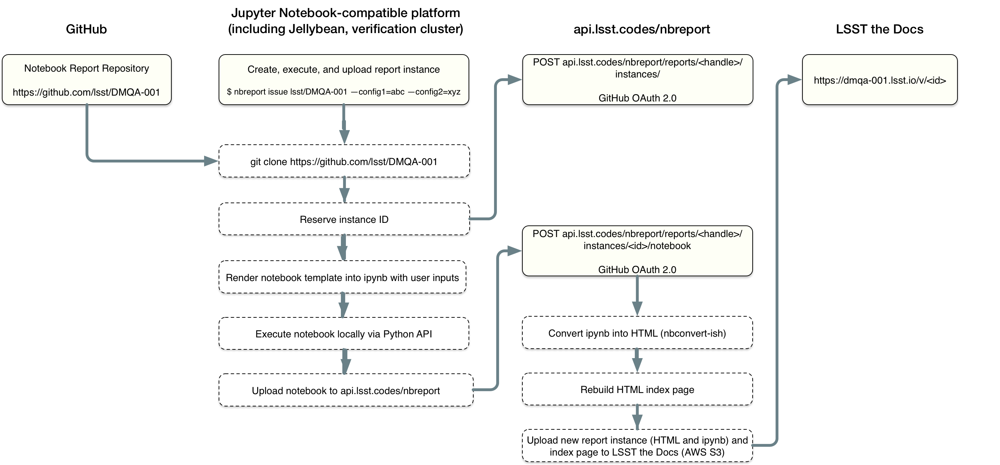

.. _sequence:

Report generation sequence
==========================

This section traces the generation of a notebook report instance.
In doing so, this section identifies the key components of the notebook report system and their designed functionality.

   Processing sequence for generating and publishing a notebook-based report.

Compute platform phase
----------------------

Notebook instances are generated on a compute platform that provides access to software libraries and datasets.
The LSST Science Platform is envisioned as the baseline compute platform.

Running on the compute platform, the generation of a report instance is coordinated by the ``nbreport`` command-line tool.
``nbreport`` is a command-line tool so that it can be universally scripted.
The all-in-one command for generating and publishing a notebook report is ``nbreport issue``.
This section describes the ``nbreport issue`` command.

The ``nbreport issue`` command begins by cloning the requested document repository.
A document repository contains a *templated* `Jupyter notebook`_.
The template language is Jinja_\ , compatible with Cookiecutter_.
Cookiecutter_ and Jinja_ have already been adopted by LSST DM for the `lsst/templates`_ repository.
The report's notebook is templated so that both code and documentation content can be updated.
For example, the Python code block for a Butler ``get`` can be templated so that the report corresponds specified dataset.

Before the template is rendered, the report instance is registered with the nbreport API service (``POST api.lsst.codes/nbreport/documents/<handle>/instances/``).
Doing so provides a unique, monotonically increasing ID for the report instance.
Registering the report instance now allows the report's instance ID to be used as a template variable.
This registration step could also be used to preallocate a DOI.

Next, ``nbreport issue`` renders a Jupyter notebook instance using the Jinja_/Cookiecutter_ API.
Besides the instance ID, ``nbreport issue`` also gathers template variables from command-line arguments.

``nbreport issue`` executes the report instance programatically using ``nbconvert``\ 's ``ExecutePreprocessor`` class.
Doing so allows ``nbreport`` to work as a "headless" service that doesn't need to open a browser window to execute a Jupyter Notebook.
The executed notebook is saved as an ``ipynb`` file.

Finally, ``nbreport issue`` uploads that ``ipynb`` file to the nbreport web service (``POST api.lsst.codes/nbreport/documents/<handle>/instances/<id>``).
All interactions with the web service are authenticated with GitHub-based OAuth, and authorized by GitHub organization membership.

Web service-based publishing phase
----------------------------------

Once the ``api.lsst.codes/nbreport`` web service receives the ``ipynb`` file for the report instance, it converts that ``ipynb`` file into an LSST-branded HTML page using `nbconvert`_.
This report web page is similar in appearance to notebook-based technical notes.
The web service uploads the HTML page for the report, in addition to the source ``ipynb`` file, to LSST the Docs.
The notebook-based report system uses LSST the Docs's *editions* feature to render each report instance at separate ``/v/<id>`` paths.

The ``api.lsst.codes/nbreport`` web service also generates an index page of all report instances.
This index page is displayed at the report's main URL.
For example, if the report's handle is ``DMQA-001``, the main URL is ``https://dmqa-001.lsst.io``.
The URL for an individual report instance with an ID of ``1`` is then ``https://dmqa-001.lsst.io/v/1``.

At its most basic, the index page provides a chronological listing of reports.
The index page may also be developed to enable filtering and search of reports based on template variables.
